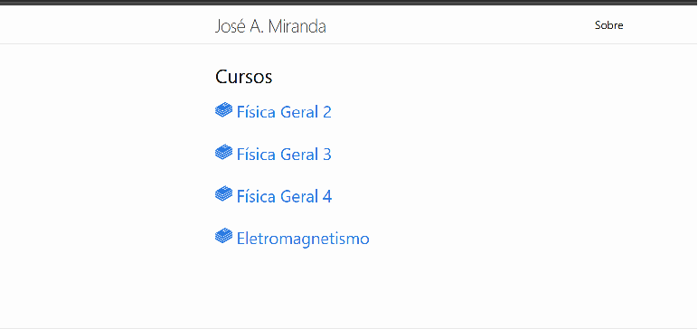

# Prof. José A. Miranda Website

This project is the website of Professor José Américo Miranda. It was made initially with JS, CSS and HTML only by Pedro Medeiros and after converted to React by Habakuk Conrado. 

## 📸 Preview



## 🚀 Technologies Used

This project was built using:

- [React](https://reactjs.org/)
- [Vite](https://vitejs.dev/)

## 📦 Installation

```bash
# Clone the repository
git clone https://github.com/jamericomiranda/jamericomiranda.github.io
cd project-name

# Install dependencies
npm install

# Start the development server
npm run dev